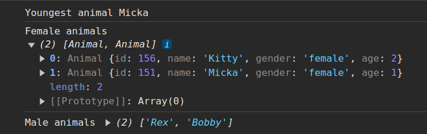

# Exercise 1

## Part 1
In main.js create class Animal, which has next properties:
- `id` which should be autogenerated (use Math.random method)
- `name`
- `gender` (female/male)
- `age`

Here is test array for four animals:

```javascript
const animals = [
  new Animal("Kitty", "female", 2),
  new Animal("Rex", "male", 3),
  new Animal("Bobby", "male", 4),
  new Animal("Micka", "female", 1),
];
```

## Part 2
Create `animalsService.js` and implement in it next methods:

### getYoungestAnimal
Method accepts array of animals as a parameter and returns the youngest animal

### getFemaleAnimals
Method accepts array of animals as a parameter and returns all female animals

### getMaleAnimals
Method accepts array of animals as a parameter and returns all male animal names


## Expected Outputs
