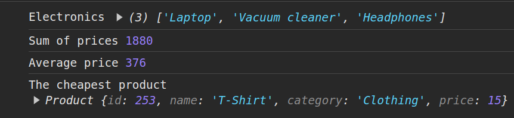

# Exercise 1

Mandatory in this exercise is to use default export.

## Part 1
In main.js create class Product, which has next properties:
- `id` which should be autogenerated (use Math.random method)
- `name`
- `category`
- `price`

Here is test array:

```javascript
const products = [
  new Product("Laptop", "Electronics", 1700),
  new Product("Dress", "Clothing", 35),
  new Product("T-Shirt", "Clothing", 15),
  new Product("Vacuum cleaner", "Electronics", 70),
  new Product("Headphones", "Electronics", 60),
];
```

## Part 2
Create `productsService.js` and implement in it next methods. Remember that all these methods needs to be exported by using default export.

### getProductsByCategory
Returns all product names whose category is equal to parameter category.

### getSumOfPrices
Returns sum of prices for all products.

### getAveragePrice
Returns average price of all products.

### getTheCheapestProduct
Returns the cheapest product.

## Expected Outputs
