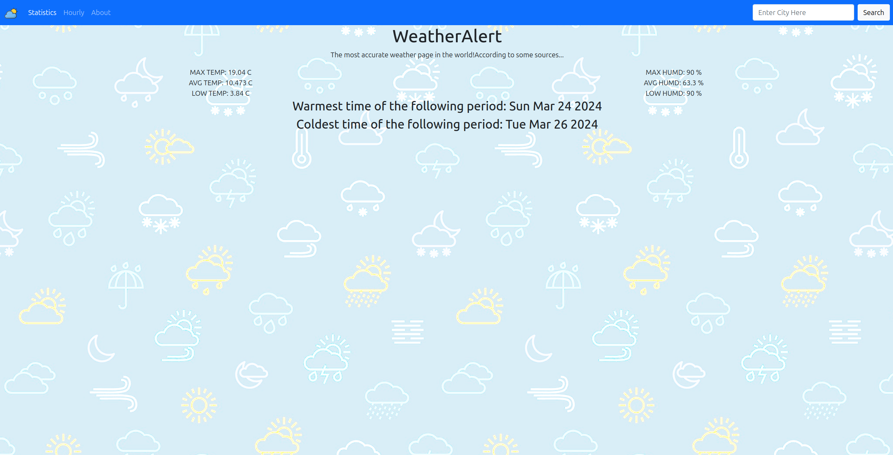

# Step 2

The goal of this step is to implement `Statistics` page of the app.

## API details

API that you will be using in this step is `https://api.openweathermap.org/data/2.5/forecast?q=${city}&units=metric&APPID=${API_KEY}`. This API is free but requires an account. You will need to generate your own API key at `https://openweathermap.org/`. When you make an account there would be an API keys tab that you can open. There you can find your API key. If there is no API key, you can generate it by clicking on the button on the right that says Generate. With this key, you can make 60 calls a minute

## Page details

As we said before, in this step we will implement `Statistics` page. It includes:
* Average, Highest, and Lowest temperature
* Average, Highest, and Lowest humidity
* Warmest and Coldest time

This data is not returned directly from the API - you will need to do calculations from the data that API has returned in order to show this info.

## Example page
