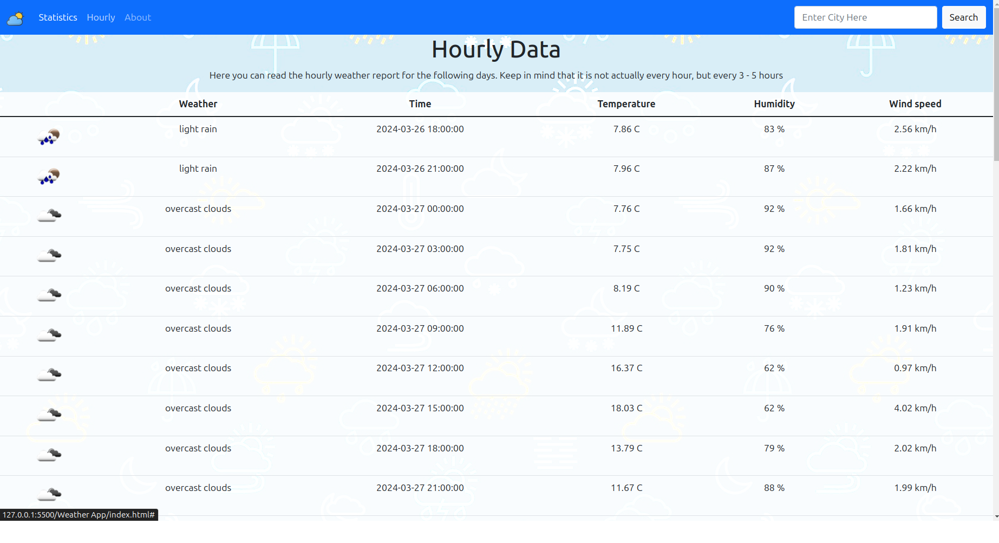

# Step 3

The goal of this step is to implement `Hourly` page of the app.

## Page details

On this page we can see weather details per hour.

This page has table in it with next columns:
* icon (You will need to fetch every icon from the API `http://openweathermap.org/img/w/${ICON-CODE-HERE}.png`
Ex: `http://openweathermap.org/img/w/10d.png`)
* description of weather
* date and time when that weather was measured
* temperature
* humidity
* wind speed

This data is not returned directly from the API - you will need to do calculations from the data that API has returned in order to show this info.

## Example page

